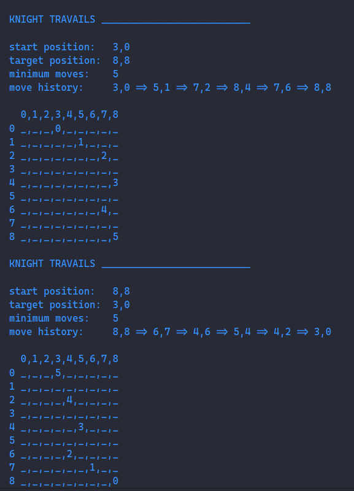
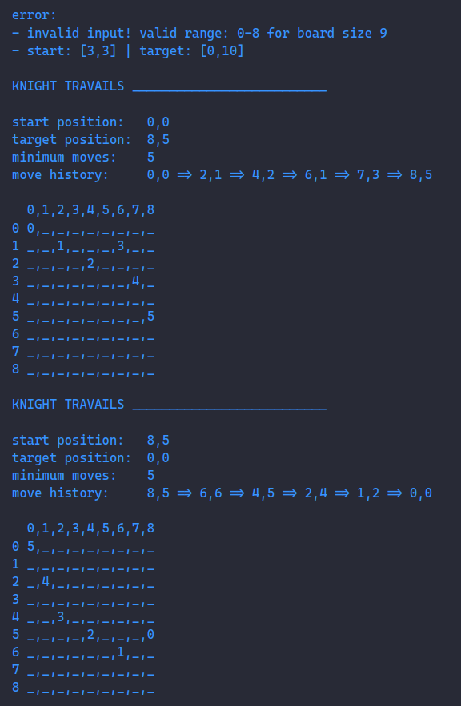
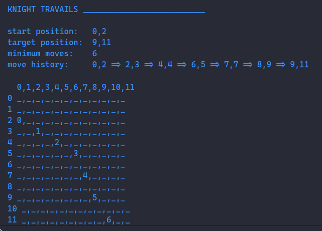

# Odin Project #16: Knights Travails

Welcome to Bryan Miller's Knights Travails Project, the [sixteenth assignment](https://www.theodinproject.com/lessons/javascript-knights-travails) within the Odin Project curriculum. The goal of this repo is to practice the following skill sets:

- Vanilla JavaScript
  - Breadth-First Search
  - Queues (FIFO: First-in, First-out)
  - Classes
  - Array Destructuring

## Summary

At first glance, completing _Knights Travails_ seemed like an impossible task. Thankfully, the Odin Project prepared us for situations like this. After breaking down the larger problem into manageable, bite-size problems, I was able to figure it out. It may not be the most computationally efficient or elegant solution, but it gets the job done.

I broke the logic down for this problem into two sections:

## `Gameboard` Class

The `Gameboard` Class's responsibilities include:

- `create()`: returns a 2d array, representing the gameboard
- `print()`: prints the gameboard array to the console
- `getKnightMoves()`: returns an array of possible moves from a specific location on the board
- `markMove`: receives a position and changes its value within the gameboard's 2d array.
- `markMoveHistory`: receives an array of moves & calls `markMove` on all elements within it
- `isPositionOnBoard`: returns true if a given position falls within the bounds of the gameboard

## `knightMoves` Function

`knightMoves()` is where all the magic happens. It accepts a starting position, target position and an optional board size argument. Here's how it works:

- Instantiates a new gameboard object with the above `Gameboard` Class
- Checks the position arguments and prevents positions that fall outside the bounds of the gameboard

From there, I knew that depth-first search was not a viable way of finding the shortest path to the target position. Therefore, I went with an iterative, breadth-first approach.

Initially, I couldn't wrap my head around not only finding the shortest travel distance but keeping track of all the moves along the way. Instead, I created a breadth-first solution, utilizing a queue and for loop, that simply counted the number of steps it would take to get to the target position, without keeping record of all moves made.

In order to find out if the current position matched the target position, I needed to compare two arrays. This threw me for a loop, but Google & Stackoverflow came to the rescue with the string conversion method.

Having a `.print()` method available to me and visually watching the ouput via the console and debugger, it became obvious that I was repeating a lot of moves on the board. If a previous iteration had already visited a position on the board, the current iteration trying to make that same move must be equal to or less efficient than the original move. So, I created an `allPreviousMoves` Set and prevented all future duplicate moves with a conditional statement.

My algorithm was improving, but I still didn't have a solution for tracking all of the moves along the shortest path. Then, it dawned on me: I can replace the counter (aka tree level) with a copy of all previous moves made by the current iteration. I swapped the counter with a nested `currentPositionsHistory` array and the rest is history.

All in all, this assignment has cemented the importance of keeping a growth mindset and utilizing the problem solving techniques taught to us earlier on in the Odin Project.

## Screenshots



> Error handling



> XL Chessboard Example



## Links

- [My Odin Project Progress](https://github.com/bmilcs/odin-project)

## Deployment

```sh
# clone repo
git clone https://github.com/bmilcs/odin-knights-travails
```
